# Overview of debugging tools for Kubernetes

Let's deploy an app with an issue to debug (demo app forked from https://github.com/oskapt/rancher-demo)

```sh
kustomize build ./demo/base/ | kubectl apply -f -
```

The application is exposed at http://demo.lens-debug.pac.dockerps.io but doesn't seem to respond.

```sh
curl -I demo.lens-debug.pac.dockerps.io

HTTP/1.1 502 Bad Gateway
Date: Mon, 03 Jan 2022 18:10:07 GMT
Content-Type: text/html
Content-Length: 150
Connection: keep-alive
```


## Useful debug commands. Lens can be used to debug easily

```sh
kubectl get events
kubectl logs [--previous]
kubectl exec POD -c container — command
kubectl describe pod
```

Overview
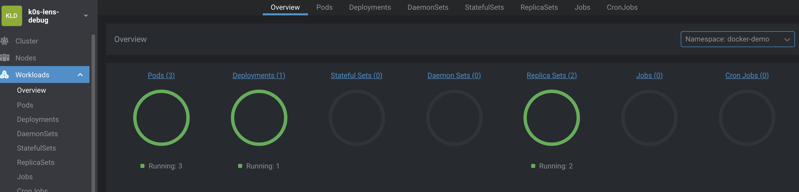
Service
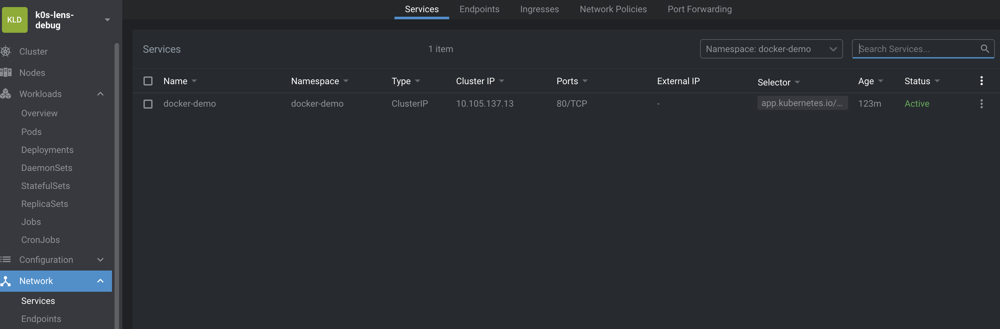
Ingress
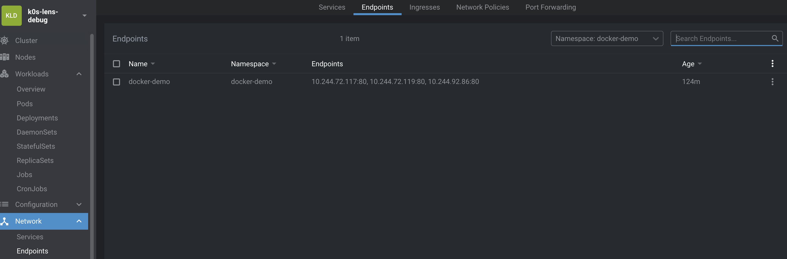

```sh
kubectl -n docker-demo get pods,svc,ingress

NAME                               READY   STATUS    RESTARTS   AGE
pod/docker-demo-77c548f97d-fwqt9   1/1     Running   0          17s
pod/docker-demo-77c548f97d-hjrdn   1/1     Running   0          17s
pod/docker-demo-77c548f97d-js7cq   1/1     Running   0          17s

NAME                  TYPE        CLUSTER-IP       EXTERNAL-IP   PORT(S)   AGE
service/docker-demo   ClusterIP   10.108.132.218   <none>        80/TCP    17s

NAME                                    CLASS   HOSTS                             ADDRESS   PORTS   AGE
ingress.networking.k8s.io/docker-demo   nginx   demo.lens-debug.pac.dockerps.io             80      17s


# --> Everything looks up and running but App is not responding
```

## Debugging

1. First let's check that everything is tied together

* Using Lens Extension Resource Map https://github.com/nevalla/lens-resource-map-extension

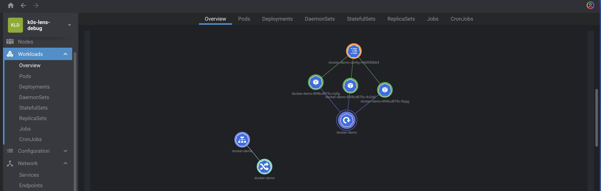

Ingress --> Service but Service !-->  Pods

* Using kubespy

> Kubespy is a tool for observing Kubernetes resources in real time
https://github.com/pulumi/kubespy

Can be used to check Service --> Healthy Pods
```sh
kubespy trace svc docker-demo/docker-demo
[ADDED v1/Service]  docker-demo/docker-demo
    ✅ Successfully created Endpoints object 'docker-demo' to direct traffic to Pods
    ✅ Successfully allocated a cluster-internal IP: docker-demo

[ADDED v1/Endpoints]  docker-demo/docker-demo
    ❌ Does not direct traffic to any Pods
```

Use Lens to edit Service Selector and fix Selector to `app.kubernetes.io/name=docker-demo`

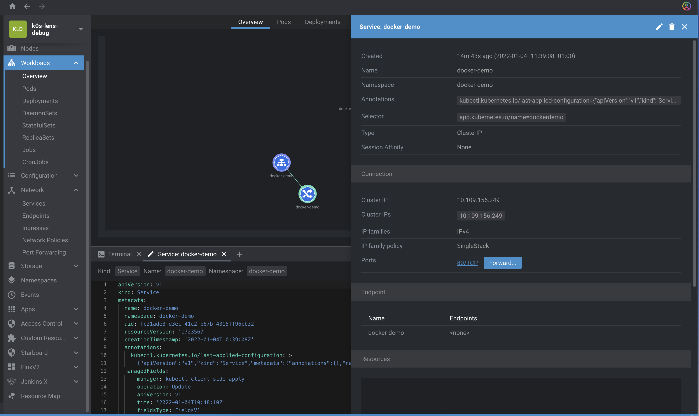

Now Service and Pods are tied togeter, but Application is still not working

```sh
curl -I demo.lens-debug.pac.dockerps.io

HTTP/1.1 502 Bad Gateway
Date: Mon, 03 Jan 2022 18:10:07 GMT
Content-Type: text/html
Content-Length: 150
Connection: keep-alive
```

2. Check App Pod logs

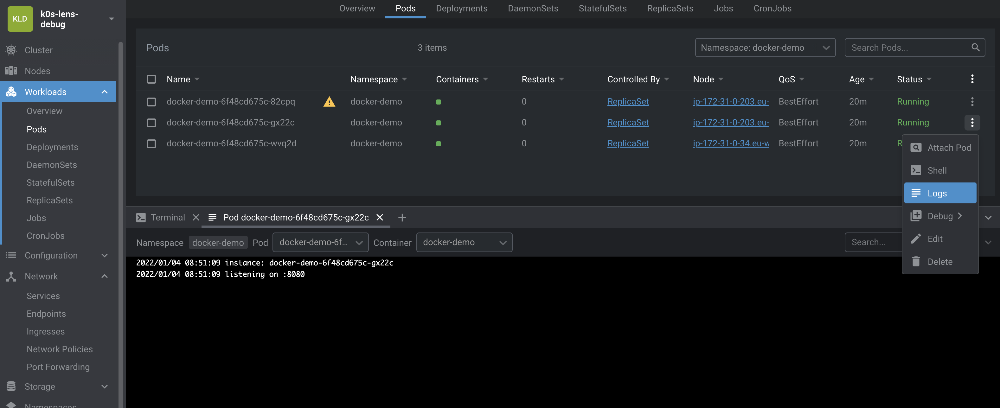

```sh
kubectl -n docker-demo logs deploy/docker-demo -f --since 1m

# -—> Application is started and is listening
```

3. Let’s try to exec in the Pod

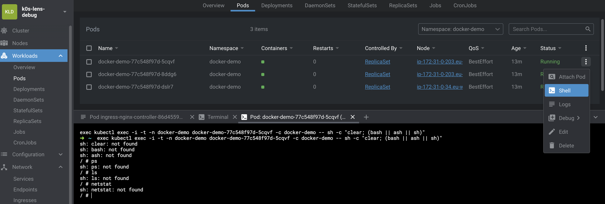

```sh
kubectl -n docker-demo exec deploy/docker-demo -c docker-demo -- netstat -anlp
error: Internal error occurred: error executing command in container: failed to exec in container: failed to start exec "fa904d76a158470bf6bf11366fd63e53b68aad516fc1e2941a9b12de8d6b0bd0": OCI runtime exec failed: exec failed: container_linux.go:380: starting container process caused: exec: “netstat: executable file not found in $PATH: unknown

# --> Shell has no debugging command e.g. ps, ls, netstat
```

4. Let’s use `kubectl debug` feature to connect to a Pod Process/Network namespace using a tooling container

> About kubectl debug  
Use Ephemeral Container - Beta in kube 1.23.  
Here i’m using a k0s cluster with latest version.

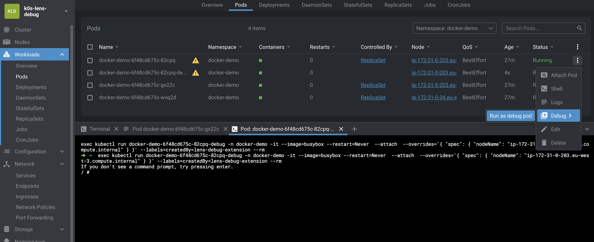

```sh
# --target enables process namespace sharing. Must be supported by the Container Runtime
kubectl -n docker-demo debug -it [POD] --image nicolaka/netshoot --target docker-demo

ps -ef
netstat -anlp

# -> Process listening on port 8080

# Check if Application is responding on port 8080
curl -I http://localhost:8080

HTTP/1.1 200 OK
Date: Mon, 03 Jan 2022 18:18:16 GMT
Content-Type: text/html; charset=utf-8

# With describe pod, can see the ephemeral container
kubectl -n docker-demo describe pod [POD]
```

Note : If your cluster doesn't have Ephemeral Containers, you can use `kubectl debug` to create a copy of your Pod

```sh
kubectl -n docker-demo debug [POD] -it --image=nicolaka/netshoot --share-processes --copy-to=mypod-debug
```

5. Let’s try to port-forward to the Pod

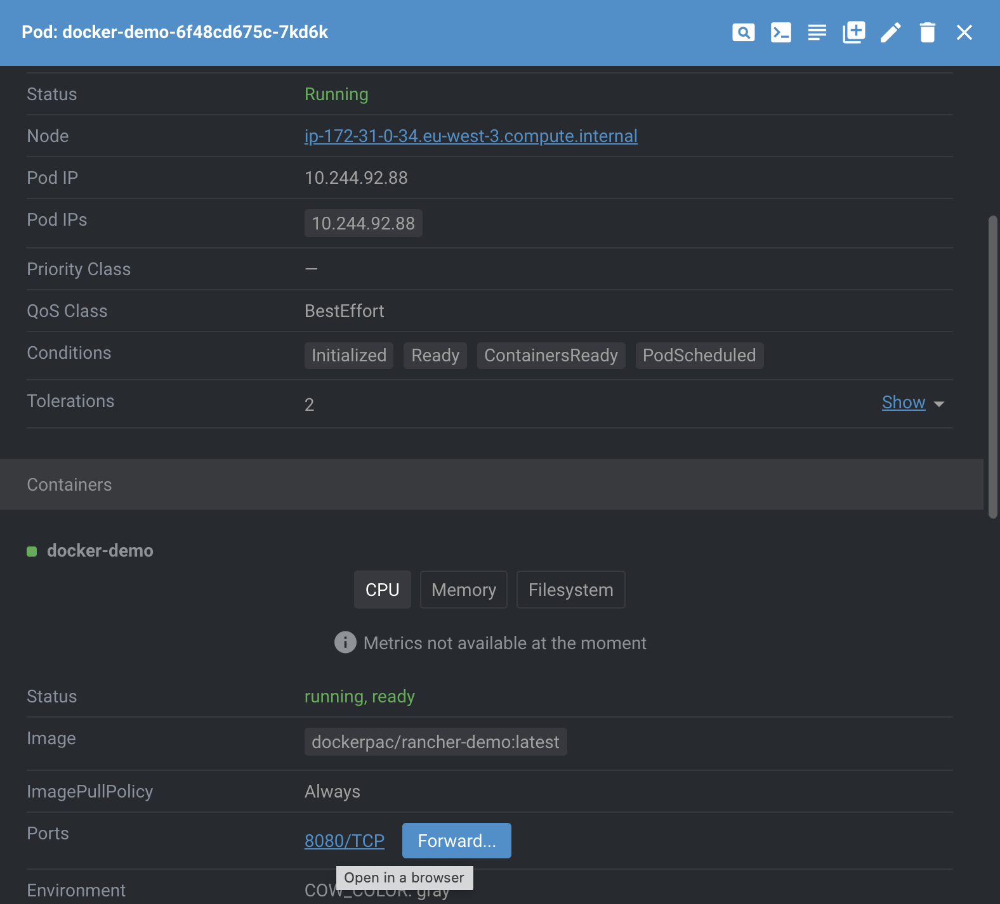

```sh
kubectl -n docker-demo port-forward [POD] 8080:8080

# -> Connection to the Pod is OK
```

6. Check if traffic is flowing to the Application Pod

> Ksniff  
kubectl krew plugin  
Doesn`t work with distroless container (Must have “sh” and “tar”, so I added them manually to my distroless container

```sh
kubectl sniff -n docker-demo [POD] -c docker-demo

# -—> Ingress is trying to reach out to app on port 80
```

7. Check Service definition and correct Port

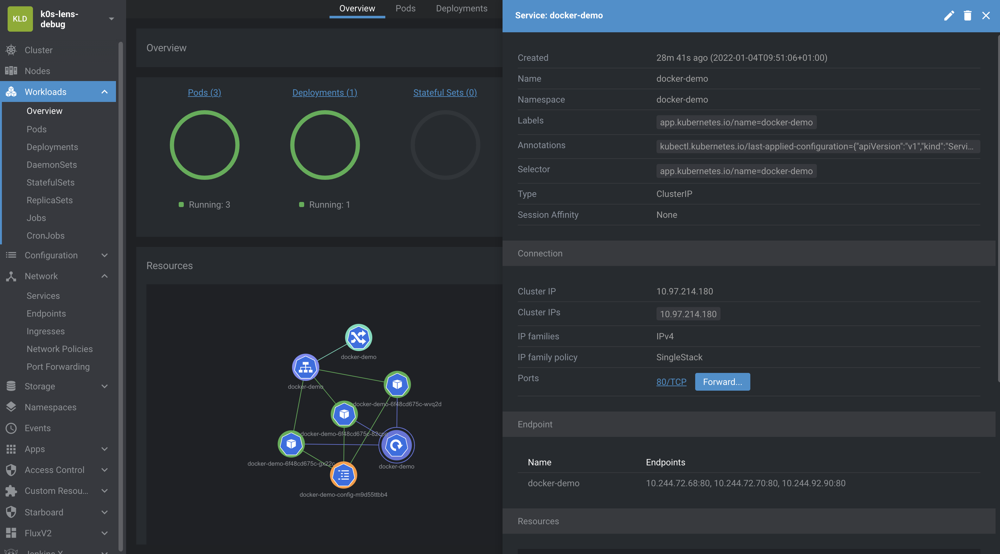

Target Port is 80 instead of 8080.  
After the correction, the application is now reachable.  


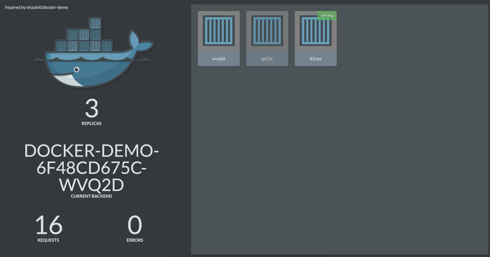

Summary of debugging actions that can be done with Lens
- Core Lens
  - Describe pods, events
  - Logs
  - Exec
  - Port-forward
  - Edit Objects live

- Extensions
  - Debug (broken!)
  - View interactions between resources (Resource Map)

Ideas for improvements
- ksniff
- kubespy
- traffic flow

# Using a Service Mesh (linkerd)

```sh
linkerd check
```

Inject linkerd sidecar

```sh
#kubectl -n ingress-nginx get deploy ingress-nginx-controller -o yaml | linkerd inject - | kubectl apply -f -

kubectl -n docker-demo annotate ingress/docker-demo nginx.ingress.kubernetes.io/service-upstream="true"

kubectl -n docker-demo get deploy docker-demo -o yaml | linkerd inject - | kubectl apply -f -
```

Expose Linkerd Dashboard

```sh
linkerd viz dashboard
```

Use Linkerd instead of Ksniff to show traffic between Ingress Controller and Demo app

```sh
linkerd viz tap ns/ingress-nginx --to ns/docker-demo

req id=0:0 proxy=out src=10.244.72.116:46548 dst=10.244.92.85:80 tls=true :method=GET :authority=demo.lens-debug.pac.dockerps.io :path=/demo
rsp id=0:0 proxy=out src=10.244.72.116:46548 dst=10.244.92.85:80 tls=true :status=502 latency=1048µs
end id=0:0 proxy=out src=10.244.72.116:46548 dst=10.244.92.85:80 tls=true duration=10µs response-length=0B
```
